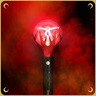

# Terminology specific to Dreamcatcher

  

* **BabySomnia**: A new **InSomnia**. Can be used both self-referentially to signal that you'll need help, or as a group term when talking about newcomers. Never use it as a derogatory term.
* **Cherry**: JiU's pomeranian. JiU's solo song [Cherry (Real Miracle)](https://www.youtube.com/watch?v=2L0q-nWS1xA) is about, and dedicated to, Cherry.
* **Ddo Ddo**: Dami's shih tzu. Dami's solo song [Butterfly](https://www.youtube.com/watch?v=w8Tfb2R_-DY) is her good bye to Ddo Ddo.
* **Dreamcatcher Company (DCC)**: The current name of the entertainment agency that manages Dreamcatcher.
* **[Dreamcatcher Mind](https://www.youtube.com/playlist?list=PLmNaKWy1cIoF57e1tG9BTdbHv1sOIGllr)**: Dreamcatcher's own variety show. Currently
  one season, with 10 episodes, has been made. Rumour has it that they made their own show because they didn't get enough invitations to other shows.
* **[Dreamcatcher Note](https://www.youtube.com/playlist?list=PLmNaKWy1cIoF84UDSoRR7mhwTVJ3EVp6w)**: Dreamcatcher's official behind-the-scene videos that are released on a regular basis during promotions and tours.
* **Dreancatger**: When Dreamcatcher were promoting their first comeback [Good Night at Mnet Countdown](https://www.youtube.com/watch?v=IyK13KctCY8), the official performance video (uploaded by Mnet) listed the group as Dreancatger.
  That was back in 2017. Even now (as of writing), 7.5 years later, this has still not been corrected. *(Note: obviously doing a reaction to the video is not recommended, seeing as it's from a music show and thus likely to trigger a copyright strike)*
* **Happyface Entertainment (HFE)**: The entertainment agency that birthed Minx and Dreamcatcher. Later renamed to Dreamcatcher Company.
* **Hogeum**: A dog belonging to one of the directors at Dreamcatcher Company. Guest stars in some of the Dreamcatcher vlives.
* **InSomnia**: The name of Dreamcatcher's official fan club. Often nicknamed Somnia. The word consists of the Latin words In Somnia joined up, meaning "In Dreams".
* **Insomnicsy**: [Insomnicsy](https://www.youtube.com/@insomnicsy), Kit, is a YouTube content producer who deserves a separate entry for having produced over 600 videos related to Dreamcatcher.
  Even Dreamcatcher themselves watch Insomnicsy's videos. Notable material includes yearly updated guides to every member, translated summaries of notable bits from vlives,
  fan-music videos, documentaries, compilations of laughter, videos of the chemistry between the different members, etc.
* **[Minx](A_brief_history_of_Minx.md)**: A group with the cute concept consisting of JiU, SuA, Siyeon, Yoohyeon, and Dami.
* **MongMongie**: Dreamcatcher's lightstick; it is certified to be the longest lightstick in K-pop since it's extensible with extra segments
  that can be bought separately (two extra segments are included with the lightstick). MongMongie with extensions evokes the feeling of
  a Wizard's staff. It also has a replacement head for the lightstick that makes it look more like a spear. It used to be programmable using
  an app, but the app no longer works with newer versions of Android.
* **Nannan**: Handong's cat.
* **Pie**: aka Sapphire. Yoohyeon's tan pomeranian. Has its own [Instagram account](https://www.instagram.com/havesomepiee/), curated by Yoohyeon's brother.
* **The World of Dreamcatcher**: Dreamcatcher's interpretation of the K-drama The World of the Married.
  SuA got bored during the Covid-19 lockdown and recruited Siyeon. Initially the plan was that just the two of them would play all roles (Gahyun would act as camera person),
  but the other members soon wanted roles. Siyeon plays 4 roles (including one scene where she slaps herself), JiU plays Gahyun's baby, etc.
  They also recorded a soundtrack that's utterly magnificent.

## Some K-pop idols with connections to Dreamcatcher

* **[9Muses](https://9-muses.fandom.com/wiki/9MUSES)**: A girl group. Connected to Dreamcatcher via their main vocalist and leader, **Ryu Sera** (see separate entry).
* **[ATEEZ](https://atiny.fandom.com/wiki/ATEEZ)**: A boy band. Uses mostly the same producers as Dreamcatcher.
* **[Dal★Shabet](https://dalshabet.fandom.com/wiki/Dalshabet_Wiki)**: Dreamcatcher & Minx' sunbaenims at Happyface Entertainment.
* **[Elkie Chong (Chong Ting-yan)](https://crystalclearclc.fandom.com/wiki/Elkie)**: Soloist. Lead vocalist of CLC. Friends with Handong.
* **[Girls' Generation (aka SNSD)](https://girls-generation.fandom.com/wiki/Girls%27_Generation)**: One of K-pop's most famous girl groups. Dami's favourite girl group. She has met several of their members and received their autograph.
* **[Hwiseo (Jo Hwi-hyeon)](https://h1-key.fandom.com/wiki/Hwiseo)**: Main vocalist in the girl group H1-KEY. Performed a cover of *Titanium* together with SuA.
* **[KARD](https://kard.fandom.com/wiki/KARD)**: A coed group. Just like Dreamcatcher they are more popular internationally than in South Korea. Dami is close friends with Somin and Jiwoo.
* **[Kei (Kim Ji Yeon)](https://lovelyz.fandom.com/wiki/Kei)**: Soloist. Main vocalist and lead dancer of Lovelyz. Friends with SuA.
* **[Moonbyul (Moon Byul-yi)](https://mamamoo.fandom.com/wiki/Moon_Byul)**: Soloist. Rapper of Mamamoo. Has invited Dreamcatcher several times to her radio show *Studio Mooon Night*.
* **[Rolling Quartz](https://kindie.fandom.com/wiki/Rolling_Quartz)**: An K-rock girl group. Their drummer, Yeongeun, has given Handong drumming lessons. Rolling Quartz has released a cover of *Chase Me*.
* **Ryu Sera**: Ex-leader and main vocalist of the girl group 9Muses. Famously outspoken critic of the K-pop industry [9Muses Ryu Sera: Extreme Diet & Trauma Story 2010-2021](https://www.youtube.com/watch?v=I99JYtot560).
  A lot of Loona fans recommended Dreamcatcher to her, so she decided to react to them. She quickly went from "I don't usually like rock sound" to being a stan;
  has done [a fantastic interview with Dreamcatcher](https://www.youtube.com/watch?v=P3lxO6LqzSc). Sometimes referred to as president of InSomnia.
* **[Seungyeon (Chang Seung-yeon)](https://crystalclearclc.fandom.com/wiki/Seungyeon)**: Soloist. Leader and vocalist of CLC. Friends with SuA.
* **[Sunmi (Lee Sun-mi)](https://sun-mi.fandom.com/wiki/Sunmi)**: Soloist. Former member of Wonder Girls. Yoohyeon's idol. Yoohyeon met her (and got her number!) during Sunmi's *You Can't Sit with Us* promotion.

## Notes

* Members of groups that have been disbanded or are on indefinite hiatus are listed as members, while members who officially left the group are listed as former members.
* This is obviously only a tiny subset. I've tried to include most of the idols encountered in the videos recommended here.
